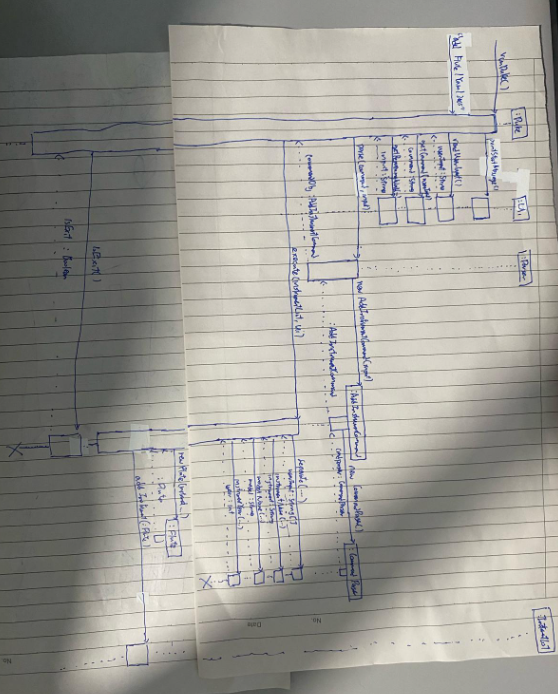

# Developer Guide

## Acknowledgements

{list here sources of all reused/adapted ideas, code, documentation, and third-party libraries -- include links to the
original source as well}

## Design & implementation

### Add Instrument feature

#### Implementation

The add instrument mechanism is facilitated by `AddInstrumentCommand`. It extends
`Command` class with execute method, to execute its command. It is initialise by
the `parser` object's parse() method. Then the `AddInstrumentCommand` object will
call execute to add instrument into the `instrumentList`.

Given below is an example usage scenario and how the add instrument mechanism behaves at each step.

Step 1: The user launches the application for the first time. `runDuke()` will be called and the user will then be
prompted for an input

Step 2: The user will then add an instrument using the `add` command word

Step 3: An `AddInstrumentCommand` object will be created and returned by `parser` object and start to execute

```  
public static Command parse(String command, String input) {
        switch (command) {
        case HELP:
            return new HelpCommand();
        case LIST:
            return new ListCommand();
        case ADD:
            return new AddInstrumentCommand(input);
        case DELETE:
            return new DeleteCommand(input);
        case RESERVE:
            return new ReserveCommand(input);
        case RETURN:
            return new ReturnCommand(input);
        case EXIT:
            return new ExitCommand();
        default:
            return new DefaultCommand();
        }
    }
```

```angular2html
        Command commandObj = parser.parse(command, input);
commandObj.execute(instrumentList, ui);
```

Step 4: The `AddInstrumentCommand` object will then call the `CommandParser` object's `seperate` method to split the
user input

```angular2html
        String[] userInput = cmdparser.separate(this.name.trim());

String instrument = cmdparser.instrumentName(userInput);
String model = cmdparser.modelName(userInput);
int year = cmdparser.instrumentYear(userInput);
```

Step 5: Depending on the instrument input by the user, the corresponding `Instrument` class will be created and added to
the `instrumentList`,
a print of the `instrumentList` will occur last.

```angular2html
        try {
switch (instrument) {
case "Flute":
instrumentList.addInstrument(new Flute(instrument, model, year));
break;
case "Piano":
instrumentList.addInstrument(new Piano(instrument, model, year));
break;
case "Guitar":
instrumentList.addInstrument(new Guitar(instrument, model, year));
break;
default:
System.out.println("invalid instrument");
}
        } catch (EmptyDescriptionException e) {
System.out.println(e.getMessage());
}
ui.printInstrumentList(instrumentList.getList());
```

#### Sequence Diagram




## Product scope

### Target user profile

{Describe the target user profile}

### Value proposition

{Describe the value proposition: what problem does it solve?}

## User Stories

| Version | As a ... | I want to ...             | So that I can ...                                           |
|---------|----------|---------------------------|-------------------------------------------------------------|
| v1.0    | new user | see usage instructions    | refer to them when I forget how to use the application      |
| v2.0    | user     | find a to-do item by name | locate a to-do without having to go through the entire list |

## Non-Functional Requirements

{Give non-functional requirements}

## Glossary

* *glossary item* - Definition

## Instructions for manual testing

Available Commands:

1. help: list all commands
2. list: list all instruments
3. add: adds a new instrument
4. delete: deletes an existing instrument
5. reserve: reserves an available instrument
6. return: returns a reserved instrument
7. exit: quit SirDukeBox

{Give instructions on how to do a manual product testing e.g., how to load sample data to be used for testing}
