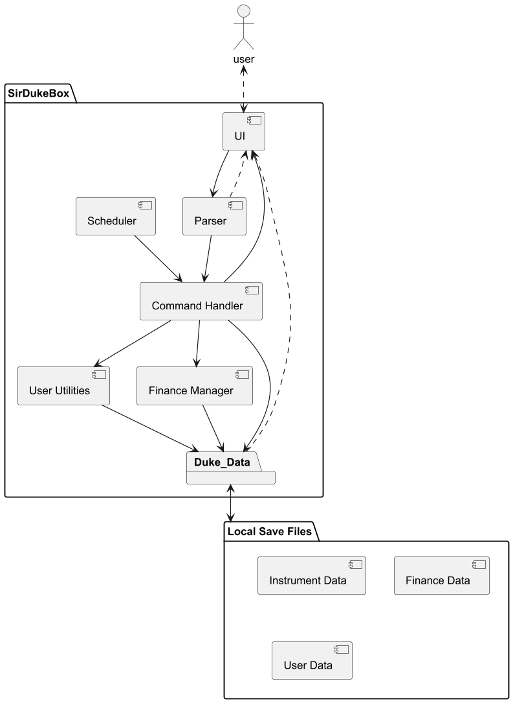
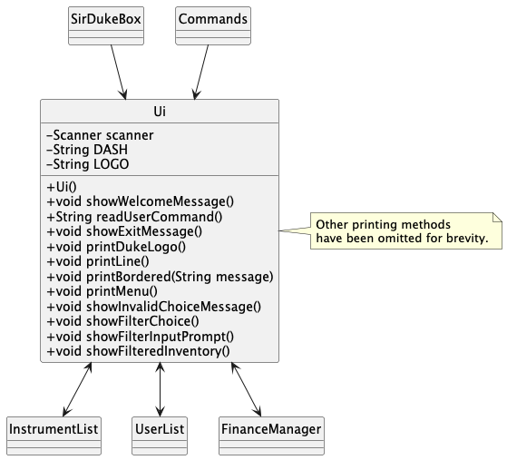
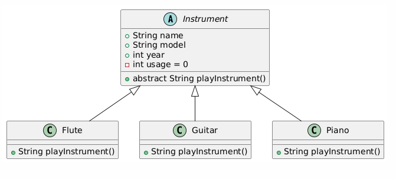

    # Developer Guide

* **Acknowledgements**
* **[Design](#design)**
    * [Architecture](#architecture)
* **[Implementation](#implementation)**
    * Logic Component
    * UI Component
    * Parser Component
    * Command Component
    * Storage Component
* **[Appendix:Requirements](#appendix)**
    * Product scope
    * User stories
    * Use cases
    * Non-Functional Requirements
    * Glossary
* **[Appendix: Instructions for manual testing](#appendix-instructions-for-manual-testing)**

* * *

## **Acknowledgements**

SirDukeBox uses the following tools for development:

1. JUnit5 - For unit testing
2. Gradle - For checkstyle, build automation and dependency management
3. PlantUML - For diagram creation

* * *

## **Design**

### Architecture

The **_Architecture Diagram_** given above explains the high-level design of SirDukeBox.

Given below is a quick overview of main components and how they interact with
each other.

**Main components of the architecture**

**`SirDukeBox`** ([`Duke`](https://github.com/AY2425S2-CS2113-W11-1/tp/blob/master/src/main/java/seedu/duke/Duke.java))
is the main class and is in
charge of the app launch and shut down.

* At app launch, it initializes the other components in the correct sequence, and connects them up with each other.
* Loads or creates the plaintext save files in the docs folder.
* Populates the `Duke_Data` which includes the Instrument Data, Finance Data and User Data.
* At shut down, it shuts down the other components and invokes cleanup methods where necessary.

The bulk of the app’s work is done by the following four components:

* **`Duke`**: The logic manager of the app.
* **`UI`**: The UI of the App.
* **`Parser`**: The command parser and caller.
* **`Command Handler`**: The command executor
* **`Storage`**: Reads data from, and writes data to, the hard disk.
* **`Finance Manager`** Manages the finance of the application

**`Commons`** represents a collection of classes used by multiple other
components.

**How the architecture components interact with each other**

The _Sequence Diagram_ below shows how the components interact with each other
for the scenario where the user issues the command `add Flute|ModelName|2004`.

## **Implementation**

### Duke Logic component

How the logic component works:

1. After initialising the necessary components (`Storage`, `Ui`, `UserUtils`, `Parser`), the logic will call `Ui` to
   read the user input.
2. `Duke` will then call `Parser` to parse the user input to a executable.
3. `Duke` executes the resulting command.
4. `Duke` then checks if it is an exit command, and exits the program if so.

Upon exit,

5. `Duke` calls on `Storage` to save the working information from the current session and terminates.

### UI component

The `UI` component,

* Handles all user input and system output to the command line.
* Is kept as an input to most classes to maintain the use of one `Ui` object throughout the operation of the program

### Parser component

The `Parser` component,

How the `Parser` component works:

1. When the user enters a command, the `Parser` will match the input to any of the known commands.
2. This results in a `Command` object (more precisely, an object of one of its subclasses e.g., `DeleteCommand`) which
   is executed by the `SirDukeBox`.
3. The command's `execute()` method is called and the specific behaviour of the command is executed.

### Instrument component

**Classes**: [`InstrumentClasses`](https://github.com/AY2425S2-CS2113-W11-1/tp/tree/master/src/main/java/instrument)

* Represents a real-life instrument object, to be played, rented, returned, etc.

### Command component

**Classes**: [`CommandClasses`](https://github.com/AY2425S2-CS2113-W11-1/tp/tree/master/src/main/java/commands)

The command component comprises command classes that all inherit from the common abstract class `Command`. Execution
of commands is achieved through calling the `execute()` method, which defines each command's specific behaviour. This
implementation simpifies extension and maintenance across the codebase.

Given below is an example usage scenario of the `AddInstrumentCommand` class and how the add instrument mechanism
behaves at each step.

**Step 1**: The user launches the application for the first time. `runDuke()` will be called and the user will then be
prompted for an input

**Step 2**: The user will then add an instrument using the `add` command word

**Step 3**: An `AddInstrumentCommand` object will be created and returned by `parser` object and start to execute

**Step 4**: The `AddInstrumentCommand` object will then call the `CommandParser` object's `seperate` method to split the
user input

**Step 5**: Depending on the instrument input by the user, the corresponding `Instrument` class will be created and
added to
the `instrumentList`,
a print of the `instrumentList` will occur last.

### Finance Manager component

**API** : [
`FinanceManager.java`](https://github.com/AY2425S2-CS2113-W11-1/tp/blob/master/src/main/java/finance/FinanceManager)

The `Finance Manager` component,

* Interacts with finance data through following commands
    1. `add:`
    2. `subtract:`
    3. `get:`

* Upon returning of item will automatically calculate the amount owed based on rental fee of 20 and daily overdue
  fee of 50

### Storage component

**API** : [`Storage.java`](https://github.com/AY2425S2-CS2113-W11-1/tp/blob/master/src/main/java/storage/Storage.java)

The `Storage` component,

* can save instrument data (`name`, `model`, `year`, `rentFrom`, `rentTo`, `reserved`) in external external save file
  `data/SirDukeBox.txt`
* reads entries back into current session when program is run again

### Other notable classes

**`UserUtils`**

* Common methods used to implement the `User` and `UserList` feature

**`Scheduler`**

* Manages the `datetime` checking feature of the return dates of rentals

* * *

## **Appendix: Requirements**

### Product scope

**Target user profile** :

* has a need to manage a significant number of instruments for rental
* prefer desktop apps over other types
* can type fast
* prefers typing to mouse interactions
* is reasonably comfortable using CLI apps

**Value proposition** : Manage instrument rentals faster than a typical mouse/GUI driven app! Keep track of stock, user
rental history, and instrument-related finances in an all-in-one tracking app.

### User stories

Priorities: High (must have) - `* * *`, Medium (nice to have) - `* *`, Low
(unlikely to have) - `*`

 Priority | As a …​                                            | I want to …​                     | So that I can…​                                        
----------|----------------------------------------------------|----------------------------------|--------------------------------------------------------  
 `* * *`  | new user                                           | see usage instructions           | refer to instructions when I forget how to use the App 
 `* * *`  | user                                               | add a new intrument              |
 `* * *`  | user                                               | delete an instrument             | remove entries that I no longer need                   
 `* * *`  | user                                               | list the instruments I have      | see all the working instruments in the current session 
 `* *`    | user                                               | track clients' rental statistics | know which instruments are rented by who               
 `*`      | user with many instruments in the instruments list | sort instruments by type         | see instuments of interest easily                      

### Use cases

(For all use cases below, the **System** is `SirDukeBox` and the
**Actor** is the `user`, unless specified otherwise)

**Use case: Delete an Instrument**

**MSS**

1. User requests to list instruments
2. SirDukeBox shows a list of instruments
3. User requests to delete a specific instrument in the list
4. SirDukeBox deletes the instrument

Use case ends.

**Extensions**

* 2a. The list is empty.
    * 2a1. SirDukeBox shows a 'list is empty' message.

Use case ends.

* 3a. The given index is invalid.
    * 3a1. SirDukeBox shows an error message.

Use case resumes at step 2.

### Non-Functional Requirements

1. Should work on any _mainstream OS_ as long as it has Java `17` or above installed.
2. Should be able to hold up to 1000 instruments without a noticeable sluggishness in performance for typical usage.
3. A user with above average typing speed for regular English text (i.e. not code, not system admin commands) should be
   able to accomplish most of the tasks faster using commands than using the mouse.

### Glossary

* **Mainstream OS** : Windows, Linux, Unix, MacOS
* **Private contact detail** : A contact detail that is not meant to be shared with others

* * *

## **Appendix: Instructions for manual testing**

Available Commands:

1. `help`: list all commands
2. `list`: list all instruments
3. `add`: adds a new instrument
4. `delete`: deletes an existing instrument
5. `reserve`: reserves an available instrument
6. `extend`: changes the return date of a reserved instrument
7. `return`: returns a reserved instrument
8. `user`: choose user commands
9. `recommend`: recommends a recommended instrument
10. `exit`: quit SirDukeBox

Please refer to our UserGuide for more details on each command.

Given below are instructions to test the app manually.

**Note:** These instructions only provide a starting point for testers to work
on; testers are expected to do more _exploratory_ testing.

### Launch and shutdown

1. Initial launch

    1. Download the jar file and copy into an empty folder

    2. Run `java -jar tp.main.jar` to run the app

### Deleting an instrument

1. Deleting an instrument while all instruments are being shown

    1. Prerequisites: List all instruments using the `list` command. Multiple persons in the list.

    2. Test case: `delete 1`

Expected: First instrument is deleted from the list. Details of the deleted
contact shown in the status message.

    3. Test case: `delete 0`  

Expected: No instrument is deleted. Error details shown in the status message.

    4. Other incorrect delete commands to try: `delete`, `delete x`, `...` (where x is larger than the list size)  

Expected: Similar to previous.
