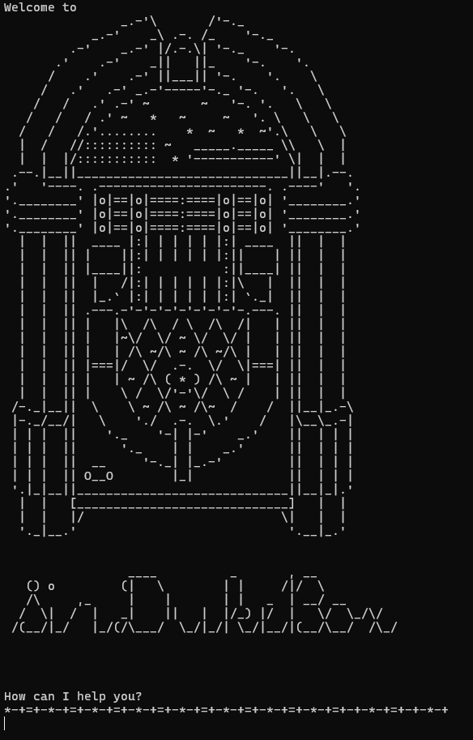

# User Guide

## Introduction

`SirDukeBox` is a **desktop app for managing instrument inventory, reservations, and finances.** 

## Quick Start

{Give steps to get started quickly}

1. Ensure that you have Java 17 or above installed.
1. Down the latest version of `SirDukeBox` from [here](http://link.to/duke).
2. Copy the downloaded file to the folder you wish to use as the _home folder_ for `SirDukeBox`
3. Open a command terminal, `cd` into the folder you put the jar file in, and use the `java -jar duke.jar` command to run the application.
4. Upon start up, `SirDukeBox` should reflect the following message in your terminal: 
5. Type commands in the terminal and press Enter to execute. Here are some commands you could try:
   * `help`: Lists all available commands for the user to input
   * `list`: Lists all items currently in the database
   * `exit`: Exits the app
6. Refer to **Features** below for a detailed list of all commands  

## Features

### List out Commands: `help`

Lists all available commands. A brief description for each command is included.

Format: `help`

Example of usage: 

`help`

Expected output: 

```
Available Commands:  
help: list all commands  
list: list all instruments  
add: adds a new instrument  
delete: deletes an existing instrument  
reserve: reserves an available instrument  
extend: changes the return date of a reserved instrument  
return: returns a reserved instrument  
user: choose user commands  
recommend: recommends a recommended instrument  
exit: quit SirDukeBox
```

### Adding an Instrument: `add`

Adds a new instrument to the database. 

Format: `add INSTRUMENT_NAME|INSTRUMENT_MODEL|INSTRUMENT_YEAR`

* `INSTRUMENT_NAME` refers to the type of instrument being added (e.g. "Guitar")
* `INSTRUMENT_MODEL` refers to the brand/model of the specific instrument being added (e.g. "Yamaha")
* `INSTRUMENT_YEAR` refers to the year of production of the instrument being added (e.g. "1989")

Example of usage: 

`add Guitar|Yamaha|1989`

Expected output: 
```
*-+=+-*-+=+-*-+=+-*-+=+-*-+=+-*-+=+-*-+=+-*-+=+-+-*-+=+-+-*-+
Here is the list of instruments:
1. Guitar | Yamaha | 1989 |
*-+=+-*-+=+-*-+=+-*-+=+-*-+=+-*-+=+-*-+=+-*-+=+-+-*-+=+-+-*-+
Would you like to assign this instrument to a user? [Y/N]
```

Adding an instrument allows you to assign it to a `user` // rmb to include link to user section

### Deleting an Instrument: `delete`

Deletes an existing instrument from the database. 

Format: `delete INSTRUMENT_NUMBER`

* `INSTRUMENT_NUMBER` refers to the number assigned to the 
particular instrument. Use `list` to view each instrument's `INSTRUMENT_NUMBER`

Example of usage:

```delete 1```

Expected output:
```
Deleting instrument: Guitar | Yamaha | 1989 |
Now you have 0 instruments
*-+=+-*-+=+-*-+=+-*-+=+-*-+=+-*-+=+-*-+=+-*-+=+-+-*-+=+-+-*-+
Removed instrument [Guitar | Yamaha | 1989 | ] from user [Kash]
*-+=+-*-+=+-*-+=+-*-+=+-*-+=+-*-+=+-*-+=+-*-+=+-+-*-+=+-+-*-+
```

### List Instruments: `list`

Lists instruments stored in the database according to their `INSTRUMENT_NUMBER`

Format: `list`

Example of usage:

`list`

Expected output: 


### Adding a todo: `todo`

Adds a new item to the list of todo items.

Format: `todo n/TODO_NAME d/DEADLINE`

* The `DEADLINE` can be in a natural language format.
* The `TODO_NAME` cannot contain punctuation.

Example of usage:

`todo n/Write the rest of the User Guide d/next week`

`todo n/Refactor the User Guide to remove passive voice d/13/04/2020`

## FAQ

**Q**: How do I transfer my data to another computer?

**A**: {your answer here}

## Command Summary

{Give a 'cheat sheet' of commands here}

* Add todo `todo n/TODO_NAME d/DEADLINE`
