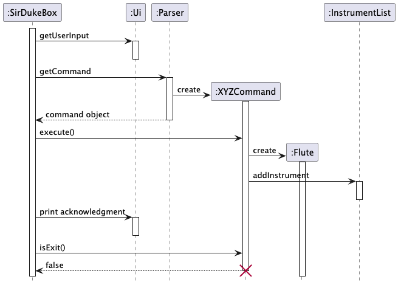
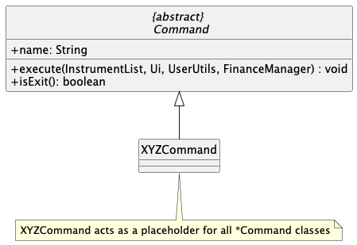
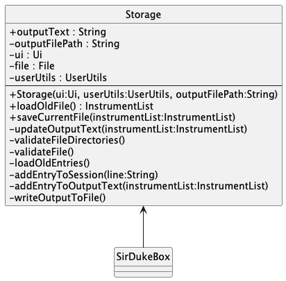
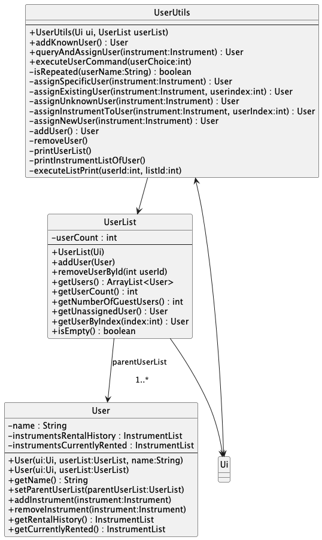
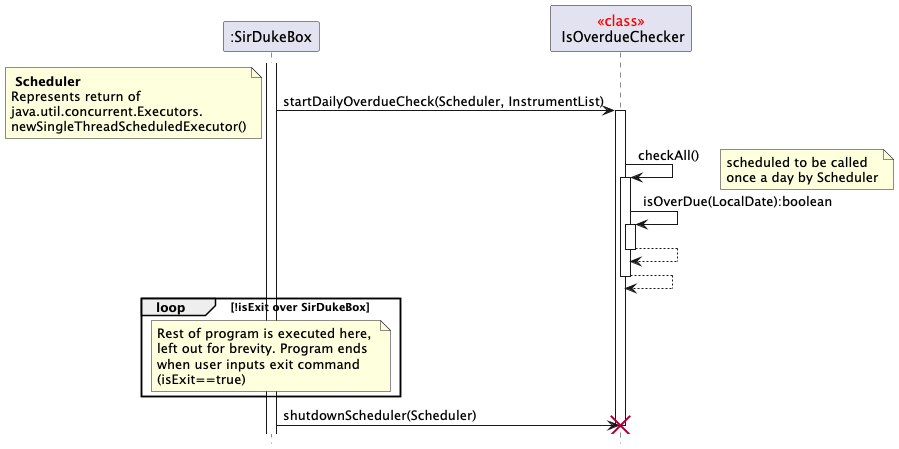

# Teng Wai - Project Portfolio Page

## Overview

Manage instrument rentals faster than a typical mouse/GUI driven app! Keep track of stock, user rental history, and
instrument-related finances in an all-in-one tracking app.

### Summary of Contributions

[**Code Contributed**](https://nus-cs2113-ay2425s2.github.io/tp-dashboard/?search=&sort=groupTitle&sortWithin=title&timeframe=commit&mergegroup=&groupSelect=groupByRepos&breakdown=true&checkedFileTypes=docs~functional-code~test-code~other&since=2025-02-21&tabOpen=true&tabType=authorship&tabAuthor=adoorknob&tabRepo=AY2425S2-CS2113-W11-1/tp%5Bmaster%5D&authorshipIsMergeGroup=false&authorshipFileTypes=docs~functional-code~test-code~other&authorshipIsBinaryFileTypeChecked=false&authorshipIsIgnoredFilesChecked=false)

**Enhancements Implemented**

* **Feature:** Added `User` functionality
    * `UserUtils`, `User` and `UserList`
* **Feature:** `Storage` for saving data
* **Enhancements:** `Ui` for main functionality
* **Enhancements:** Various cases of error handling
  * `IndexOutOfBounds` for `extend`, `reserve`, `finance`
* **Testing:** for relevant classes and methods
    * `User`, `UserList` and `UserUtils`
    * `Storage`, `FinanceStorage`
* **Testing:** implementation of mock child classes of existing classes (e.g., `StubUi`) to test code

**Contributions to UserGuide**

* Explanation of `User` commands and feature
* Bugfix 
  * missing features
  * typos

**Contributions to DeveloperGuide**

* Acknowledgements
* Architecture diagram
* Example `Command` sequence diagram
* Design and Implementation
  * `User`
  * `Storage`
  * `IsOverdueChecker`
  * Logic Component
  * Command Component
  * Storage Component
  * Other Notable Classes: `IsOverdueChecker`, `User`
* Appendix:Requirements
  * Product scope
  * User stories
  * Use cases
  * Non-Functional Requirements
  * Glossary
* Appendix: Instructions for manual testing

**Contributions to team-based tasks**

* Setting up the Github team org and repo
* Setting up tools (Github, Gradle)
* Updating developer docs
    * Overall architecture
    * Overall Design and Implementation
    * Appendix: Requirements
    * Appendix: Instructions for Manual Testing

**Review/mentoring contributions**

* Reviewed/made (informed) edits to UML diagrams
* Test features by other members:
  * `extend`, `reserve`
  * `finance`

**Contributions beyond the project team**

* Above-average number of PR peer review comments during iP PR peer review
* Submitted 18 issues during PE-D (top 10%)

## Appendix

### Contributions to the Developer Guide

As much of the Developer Guide was written by me, I have opted to leave only the diagrams I have contributed in here.

**System Architecture Example Sequence Diagram**


**Command Component**


**Storage Component**

Class Diagram:


Sequence Diagram:


**User**

Class Diagram:


Sequence Diagram:


**IsOverdueChecker**


### Contributions to the User Guide

**User**

> ### User commands - `user`
> 
> User will bring up a list of commands that pertains to users:
> 
> 1. Adding a user
> 2. Removing a user
> 3. Listing all users
> 4. Listing a user's instruments
>    ...which is selected by inputting the index of the command and>  following onscreen instructions
> 
> For option `4`, the user will be able to choose from 2 lists:
> 
> 1. `Rental History`
> * This is the list of all instruments that have been added to the user during the current session (including deleted
>   instruments)
> 2. `Currently Instruments`
> * This is the list of instruments still allocated to the user > (modified after deleting)
> 
> For example, if the current list of instruments assigned to the user is:
> 
> ```
> 1. Guitar | Yamaha | 2000
> 2. Piano | Yamaha | 2000
> ```
> 
> ...and `delete 2` is inputted,
> `CurrentInstruments` will be:
> 
> ```
> 1. Guitar | Yamaha | 2000
> ```
> 
> ...while `RentalHistory` will be:
> 
> ```
> 1. Guitar | Yamaha | 2000
> 2. Piano | Yamaha | 2000
> ```
> 
> **Example of usage:** \
> Input:
> 
> ```
> user
> ```
> 
> Expected output:
> 
> ```
> *-+=+-*-+=+-*-+=+-*-+=+-*-+=+-*-+=+-*-+=+-*-+=+-+-*-+=+-+-*-+
> What would you like to do?
> 1. Add User
> 2. Remove User
> 3. Print list of users
> 4. Print list of instruments of specific user
> *-+=+-*-+=+-*-+=+-*-+=+-*-+=+-*-+=+-*-+=+-*-+=+-+-*-+=+-+-*-+
> ```
> 
> Input:
> 
> ```
> 4
> ```
> 
> Expected output:
> 
> ```
> *-+=+-*-+=+-*-+=+-*-+=+-*-+=+-*-+=+-*-+=+-*-+=+-+-*-+=+-+-*-+
> Please select from the following existing users:
> 1. Teng Wai
> 2. Om
> 3. Kashfy
> 4. Jason
> ```
> 
> Input:
> 
> ```
> 1
> ```
> 
> Expected output:
> 
> ```
> *-+=+-*-+=+-*-+=+-*-+=+-*-+=+-*-+=+-*-+=+-*-+=+-+-*-+=+-+-*-+
> Available List Choices:
> 1. Rental History
> 2. Current Instruments
> ```
> 
> Input:
> 
> ```
> 1
> ```
> 
> Expected output:
> 
> ```
> *-+=+-*-+=+-*-+=+-*-+=+-*-+=+-*-+=+-*-+=+-*-+=+-+-*-+=+-+-*-+
> Here is the list of instruments:
> 1. Piano | Yamaha | 2000 | 
> *-+=+-*-+=+-*-+=+-*-+=+-*-+=+-*-+=+-*-+=+-*-+=+-+-*-+=+-+-*-+
> ```
> 
> ...or if list is empty:
> 
> ```
> *-+=+-*-+=+-*-+=+-*-+=+-*-+=+-*-+=+-*-+=+-*-+=+-+-*-+=+-+-*-+
> This list is empty :(
> *-+=+-*-+=+-*-+=+-*-+=+-*-+=+-*-+=+-*-+=+-*-+=+-+-*-+=+-+-*-+
> ```

